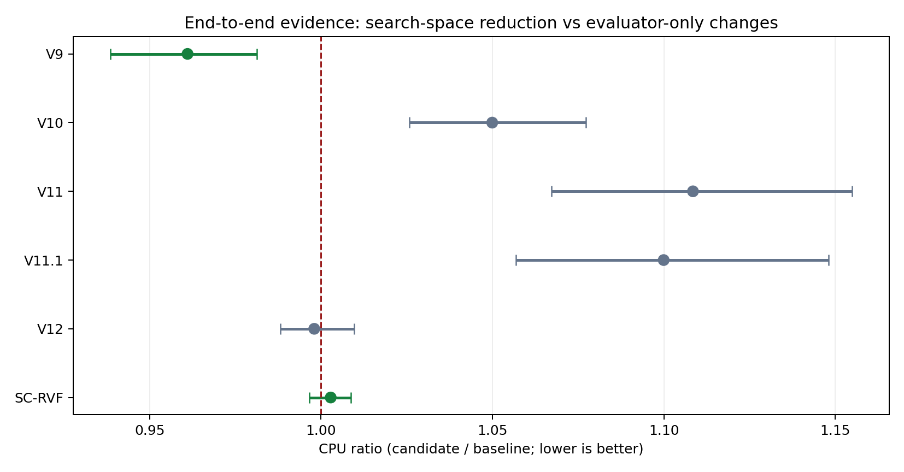
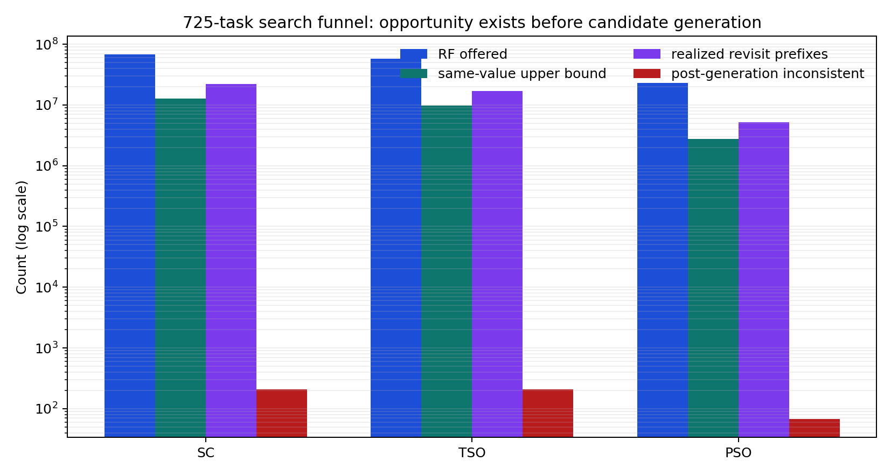

# GenMC Core Optimization / Round 0 / Direction Review / 2026-07-18

## 1. Executive Summary

现有实验已经足以改变后续研发顺序：下一阶段必须优先减少 GenMC 实际生成的 RF/CO
候选、revisit、决策子树或等价类；在此之前不再开展 cursor、cache、局部扫描、求值器
路径选择等微优化。

推荐的第一主线是修复 SC-RVF：把当前“整程序全部支持才启用”的 gate 改成有严格边界
和完整 fallback 账本的 regional quotient。推荐的第二主线是 generation-time CAT subtree
blocking：冲突证书必须在候选入队前生效，而不是在候选已经生成、入队或执行之后节省一次
检查。OOM 则需要独立的 exploration/history 压缩主线；已有 CAT sparse relation 已经将 20
个 OOM 转为 TIMEOUT，却没有新增 solved task，说明继续压 CAT relation 不是最终答案。

## 2. Experiment Identity and Decision Context

本报告不是一次新性能实验，而是对已有 retained/rejected 实现、候选空间 census、两轮
V12 725-task 实验和 SC-RVF 有界完备性证据的方向审计。它解决的问题是：为什么近期流程
从“减少执行路径/更粗等价类”偏回了求值器微优化，以及怎样设置机制门防止再次偏航。

## 3. Setup and Evaluation Protocol

证据来自三类协议：

- 725-task adapted SV-COMP 实际负载，60 CPU 秒、4 GiB、配对运行；
- 96-task/四重复等已冻结的历史正式矩阵；
- SC-RVF generated reachable-state oracle、有限 observation-set oracle、mutation 和
  864-pair broad differential。

不同实验的 baseline、重复数和任务 cohort 不完全一致，因此没有把所有 CPU ratio 合并成
一个 p-value。报告保留每个来源自己的 task-bootstrap CI，并只做机制层归纳。

核心指标按顺序分为：

1. 机制指标：RF/CO offered/queued、work added/popped、realized prefixes、完整执行数或
   quotient representatives；
2. 正确性/完备性：verdict、错误类型、reachable observations、class coverage、witness
   replay、fail-open ledger；
3. 结果指标：CPU、wall、RSS、TIMEOUT/OOM 和新增/丢失 terminal coverage。

## 4. Main Findings

### 4.1 是否改变搜索空间，是核心优化的必要门槛

V9 在生成后代前做 preventive pruning，RF+CO offered 减少 67.82%，work popped 减少
73.97%，相对 V8 的 CPU ratio 为 0.96105 [0.93854, 0.98130]，并有四个重复覆盖收益。

相反：

- V10 有 14,193,035 个 core hit，但 direct checks avoided 为 0，CPU 回退 4.99%；
- V11 将内部 reach candidates 从 2.94B 降至 489M，但完整搜索不变，CPU 回退 10.85%，
  丢失 18 个 terminal task；
- V11.1 将 base visits 从 16.12B 降至 2.73B，但 CPU 回退 9.99%；
- V12 两轮合并 CPU 为 0.998008 [0.988150, 1.009684]，无可复现收益。

这组结果明确否定了“内部操作数下降即可继续优化”的流程。以后只有实际候选、work 或
class 数下降，才进入正式性能判断。

### 4.2 合并机会存在，但 same-value 不是完备等价关系

725-task census 中，SC/TSO/PSO 分别有 12.87M、9.78M、2.79M 个 optimistic
same-value RF alternatives，约占 RF offered 的 18.93%、16.94%、12.12%。TIMEOUT 日志
的 aggregate share 约为 28%–30%。但这只是上界：同值写可能对未来 coherence、可见写、
事件集和因果序产生不同约束。

因此不能实现“同值写只留一个”。需要完整 `GoodW`、可实现性 witness、read causal order、
own/non-own source 区分、未来写回溯和 CAT acceptance 后覆盖确认。

### 4.3 现有 SC-RVF 的问题是 integration boundary，而不是局部机制完全无效

修复后的 prototype 在 20-shape、1/2-worker generated oracle 的 6,480 次调用中保持全部
reachable states，并在本地 cohort 将 1,308 次执行降为 1,283，扩展 cohort 将 294 降为
279。所有真正产生 reduction 的小程序都做了有限 observation-set 全枚举。

正式 725 SC workload 却零激活：主要被 abort/property、mutex、non-atomic、loop 的整程序
gate 拦截。继续缩窄或扩大静态白名单都不是答案；应把 quotient 应用到完整、可证明的
动态 region，并确保进入 region 前未删除 native ancestor class。

### 4.4 OOM 有另一类根因

已保留的 structural + adaptive CSR 将 large-task base bytes 降至 0.14139、RSS 降至
0.61512，并让 20 个 OOM 变为 TIMEOUT，但没有新增 terminal result。另一些 4-GiB OOM
只有 14–52 个事件、CAT state 约 25 KiB，甚至发生在首次 CAT query 前。

这部分核心问题是 exploration graph/history/worklist 的增长，而不是 CAT relation 的表示。

## 5. Statistical Validation

最稳定的正向信号是 V9/V8 CPU 0.96105 [0.93854, 0.98130]。V10、V11、V11.1 的 CI
均完全高于 1；V12 和零激活 SC-RVF 的 CI 跨 1。不同实验不进行 pooled significance。

TIMEOUT 与 same-value share 的未调整 Mann–Whitney 对比很强，Holm-adjusted p 在
`1e-44` 到 `1e-47`，rank-biserial 约 0.68；但控制最低 10,000 RF offers 后，TIMEOUT 与
completed 的 median gap 只剩 +0.62/+0.37/-0.77 个百分点。因此报告只主张 hard cohort
有大量可研究机会，不主张 same-value share 导致 timeout 或能按比例降低运行时间。

完整统计边界见 `stats-appendix.md`。

## 6. Figure-by-Figure Interpretation

### Figure 1: mechanism vs CPU

这张图用于区分“改变搜索空间”和“只改变求值成本”。读者应看到：V10/V11/V11.1 明确
回退，V12 中性；V9 是唯一 CI 完全低于 1 的近期机制。SC-RVF 虽设计上改变等价类，但正式
任务零激活，所以其点不能解释为 quotient 性能。

决策含义：没有候选/class/work reduction 的方案，不再列为核心优化。

### Figure 2: search funnel

这张图展示候选生成前后数量级差异。RF offers、same-value 上界和 realized prefixes 都是
百万到千万级，而 post-generation inconsistency 只有几十到几百。读者应看到：在 dequeue、
replay 或完整 consistency check 之后过滤，时机已经太晚。

决策含义：quotient 或 conflict propagation 必须位于 candidate generation 边界。

## 7. Failure Cases, Negative Results, and Limits

- current-prefix same-value merge 曾丢失两个 generated outcomes；加入 own/non-own source
  区分和 witness coherence order 后才恢复。
- 不能在已经 quotient 的 subtree 中途“fail open 回 native”，因为被删除的 ancestor
  alternatives 无法重建。
- SC-RVF 的有限 oracle 不是 arbitrary-program proof，也不能直接扩展到 TSO/PSO。
- 725 workload 的一些 TIMEOUT/OOM 没有最终 counters，missingness 不能视为随机。
- CPU 图跨实验只做机制归纳，不是统一 baseline 下的排行榜。

## 8. What Changed Our Belief

之前仍把“减少 CAT 内部工作”当作可能的主线。V11.1 已经提供反例：base visit 减少约
83%，端到端却慢约 10%。因此现在把项目成功判据改为：先证明实际 candidate/class/subtree
减少，再讨论 evaluator cost。

同时，SC-RVF 不应整体放弃。它是目前唯一在有限 observation oracle 上既保持结果又减少
执行的粗等价类 prototype；失败点是 zero-activation integration boundary，下一步应修复
boundary，而不是继续优化 witness 内部的数据结构。

## 9. Next Actions

### P0-A：regional SC-RVF

后续源码审计修正了进入顺序：当前实现不能安全地在任意 region 中途退出。whole-program
gate 保证第一次 merge 前就 fallback；merge 后的 `rvf.reset()` 无法恢复 ancestor RF
alternatives，`Frame`/`ThreadPool` 也没有 region ownership、covered-class revocation 或
descendant withdrawal。因此 P0-A 暂时是首要研究方向，但不是可直接编码的分支。具体进入
门见 `p0a-entry-audit.md`；当前可实现的核心分支顺延为 P0-B。

1. 定义 region ownership、entry/exit frontier、支持操作集合和 fail-open ledger。
2. 把 future writes、nested frontiers、loop iteration identity、own/non-own source、pointer
   provenance 纳入 generated oracle。
3. 为每个 bounded baseline maximal execution 生成 class signature，并验证其被 quotient
   representative 覆盖；执行数允许下降。
4. 验证 n1/n2 worker class-set 一致和 witness replay。
5. 正确性门通过后直接跑 725，不做中间性能矩阵；要求实际 activation 和 offered/queued/
   work/realized/representative 至少一类下降。

### P0-B：generation-time CAT subtree blocking

后续源码审计确认 V10 已经在 RF/CO candidate list 返回 driver 之前匹配 core，因此“把匹配
移到 generation time”并不是新机制。具体 rejected candidate 的 cycle clause 不能证明
consistent parent prefix 没有其他 extension，也不能证明 siblings 等价。P0-B 只有在能够
产生并独立验证 `no consistent extension` 证书时才能恢复；现有 positive core 不满足。

只有在冲突 clause 能映射到 earliest rollback-safe decision，并在 work item 创建前阻止该
branch 时才实现。若实际 activation rows 上 `direct-checks-avoided`、`work-added/popped` 和
`realized-prefixes` 均不下降，立即停止，不以 cache hits 继续论证。

### P1：exploration/history compression

针对首次 CAT query 前 OOM，测 retained labels、graph/history bytes、worklist bytes 和 prefix
sharing；目标是 OOM→terminal，而不是继续压已降至 14.1% 的 CAT base bytes。

### 暂缓

cursor、cache、intersection ordering、evaluator selector、保持 candidate counts 不变的
closure/composition 优化，以及没有模型完备性证明的 TSO/PSO quotient。

## 10. Artifact and Reproducibility Index

- 严格分析：`analysis-report.md`
- 统计边界：`stats-appendix.md`
- 图表说明：`figure-catalog.md`
- 冻结证据表：`evidence.tsv`、`opportunity.tsv`
- 可复现绘图：`make_figures.py`
- 图：`figures/figure-01-mechanism-cpu.{png,pdf}`、
  `figures/figure-02-search-funnel.{png,pdf}`
- 主要原始决策：
  `continuous/candidate-space-census/v9-decision.md`、V10–V12 decisions、
  `continuous/candidate-equivalence-quotient/decision-20260717.md`

本仓库未发现明确的 Obsidian 项目绑定，本报告作为本地 Markdown artifact 保存，没有执行
Obsidian write-back。
